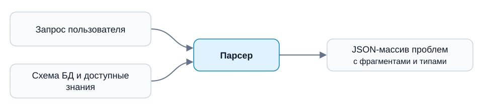

# Парсер неоднозначностей для русскоязычного Text-to-SQL

Компонент для обнаружения и классификации проблем понимания запроса к базе данных. Парсер учитывает схему БД, бизнес-правила и предоставленный дополнительный контекст, затем возвращает фрагменты, смысл которых остаётся неопределённым, и указания на недостающие необходимые сведения.

**Статус на 6 октября 2026:** подготовлены постановка задачи, контракт входа и выхода, план исследований и каркас репозитория. Настроены окружение разработки и автоматические проверки GitHub Actions. Размеченный корпус, реализация парсера, обученные модели и результаты экспериментов ещё не подготовлены.

<table>
  <tr><td>Автор</td><td>Масликов Вячеслав Владиславович</td></tr>
  <tr><td>Команда</td><td>№ 46, индивидуальный проект</td></tr>
  <tr><td>Куратор</td><td>Бурлова Альбина</td></tr>
  <tr><td>Программа</td><td>НИУ ВШЭ, магистратура «Искусственный интеллект», ИИ26, 2026/27 учебный год</td></tr>
</table>

## Задача

Один запрос может соответствовать нескольким содержательно различным трактовкам: например, «дата заказа» может означать создание, оплату или доставку. Для расчёта показателя также может не хватать необходимого бизнес-правила. Скрытый выбор трактовки приводит к результату, который пользователь не запрашивал.

Цель проекта — подготовить русский корпус и исследовать, насколько малая открытая языковая модель обнаруживает такие проблемы после учёта доступных знаний. Выход компонента предназначен для следующего этапа Text-to-SQL-системы.

Правила задачи:

- Выделять только проблемы, которые остаются после учёта предоставленного контекста.
- Отмечать отсутствующее сведение, если без него нужно существенное предположение о явно запрошенной операции или бизнес-правиле.
- Не добавлять пожелания пользователя: отсутствие просьбы сортировать или округлять само по себе не является проблемой.
- При отсутствии проблем возвращать `[]`.

Объём компонента — обнаружение, локализация и классификация. Генерация уточняющих вопросов, SQL и выполнение SQL относятся к другим компонентам.

## Вход и выход



### Вход

```json
{
  "query": "Покажи дату заказа для всех заказов.",
  "context": {
    "database": "Таблица orders: id — идентификатор заказа; created_at — дата создания; paid_at — дата оплаты; delivered_at — дата доставки.",
    "business": "",
    "additional": []
  }
}
```

`database` содержит схему, описания полей, связи и необходимые сведения о значениях; `business` — термины и правила компании; `additional` — предоставленные соглашения, релевантную историю и условия задачи. При необходимости через дополнения передаются опорная дата и часовой пояс. Скрытые авторские пояснения и эталон не входят во вход модели.

### Выход

```json
[
  {
    "text": "дату заказа",
    "start": 7,
    "end": 18,
    "location_kind": "problem_span",
    "types": ["schema_linking"],
    "missing_information": null
  }
]
```

Пример иллюстрирует контракт; названия классов предварительные. Если контекст однозначно определяет «дату заказа», соответствующая находка исчезает.

| Поле | Значение |
|---|---|
| `text` | Точная подстрока исходного `query` |
| `start`, `end` | Позиции Unicode code points с нуля; `end` не включён |
| `location_kind` | `problem_span` — само проблемное выражение; `anchor` — фраза, к которой относится отсутствующее необходимое сведение |
| `types` | Непустой список причин; несколько меток только при обоснованном пересечении |
| `missing_information` | Краткое описание недостающего сведения для `anchor`; для `problem_span` — `null` |

Парсер возвращает JSON-массив: каждая найденная проблема описывается отдельным объектом. Если проблем несколько, массив содержит несколько объектов; если проблем нет — пустой массив `[]`.

Ошибка обработки, невалидный JSON или позиции, не соответствующие фрагменту запроса, не должны выдаваться за успешный ответ `[]`.

Нельзя незаметно удалять из входного контекста описания полей, бизнес-правила и другие сведения, необходимые для понимания запроса. Если необходимый контекст не помещается в лимит модели, система должна сообщить об ограничении, а не выдавать результат, основанный на неполном контексте.

### Предварительные классы

| Причина | Что остаётся неопределённым |
|---|---|
| Лексическая | Значение слова или выражения |
| Синтаксическая | Связи между частями конструкции |
| Смысловая | Содержательная трактовка выражения |
| Привязка к схеме | Таблица, поле или сущность, обозначенная запросом |
| Намерение или операция | Ожидаемая операция, способ содержательного сравнения или агрегации |
| Привязка к бизнес-знанию | Применимое определение или правило компании |
| Нехватка необходимого знания | Отсутствующий обязательный параметр или правило |

Определения и границы классов будут зафиксированы в руководстве по разметке и проверены на пилотной выборке. `anchor` — способ локализации, а не отдельный класс.

## Данные и разметка

Планируется собственный русский корпус с адаптацией готовых источников и контролируемой генерацией новых ситуаций. Источники не содержат готовую разметку в полном контракте этого парсера: для каждого примера требуется проверить видимый контекст, оставшиеся проблемы, классы и позиции.

| Источник | Роль |
|---|---|
| Foxy-Communication и связанный LiveSQLBench | Сценарии со схемами, документацией и бизнес-знаниями |
| [PAUQ](https://github.com/ai-spiderweb/pauq) | Русские формулировки и контролируемые варианты |
| [CLAMBSQL/CLEAR](https://github.com/mengzhang18/CLEAR), [AmbiQT](https://github.com/testzer0/AmbiQT) | Подходящие неоднозначные ситуации и дополнительное покрытие |
| Новые русские сценарии | Необходимые сведения, бизнес-термины и случаи, недостаточно покрытые источниками |

[AMBROSIA](https://ambrosia-benchmark.github.io/) рассматривается для дополнительной отложенной проверки; [RedSQL](https://github.com/BrodskaiaIrina/functional-text2sql-subsets) — резерв русской доменной проверки. Официальный Foxy-Communication оценивает полного SQL-помощника; для парсера неоднозначностей нужна отдельная процедура оценки.

[NoisySP](https://drive.google.com/file/d/1iucIjvQ7K1X5hxHdtmWhOWORmAVhUVEV/view?usp=sharing) из проекта [DTE](https://github.com/wbbeyourself/DTE) также рассматривается как дополнительный источник данных; его пригодность для разметки по правилам проекта предстоит проверить.

Подготовка корпуса:

1. Подготовить руководство с определениями классов и правилами разметки, затем проверить его на пилоте из 20–30 разнообразных задач.
2. Адаптировать запросы и контекст; генерировать недостающее покрытие по заданным сценариям; повторно проверять ответы без подсказки авторского замысла.
3. Проверять формат автоматически, смысл — повторным разбором и ручным аудитом. Автоматические метки обучающей части не приравниваются к человеческому эталону.
4. Проверить вручную весь итоговый test; спорные случаи и существенную часть test направить на вторую содержательную проверку.
5. Разделить данные по семействам исходных задач. Переводы, перефразировки, варианты контекста и родственные схемы сохранять в одной части; учитывать пересечения источников.

Рабочий ориентир первой версии — около **500 train / 100 development / 250 test**. Для train/development предполагается примерно **60% запросов с проблемами и 40% без проблем**. Это планируемый состав, а не статистика будущих пользователей. Размеры и доли уточняются после пилота; расширение train до 1 000–2 000 рассматривается по результатам.

Корпус включает несколько проблем в запросе, оба способа локализации, необходимые отсутствующие параметры, однозначные случаи и случаи без домысливания пожеланий. Контрастные семейства содержат один запрос с отсутствующим, разрешающим, частичным и нерелевантным контекстом. Итоговый русский test закрыт от обучения и настройки; английские родственники его задач также исключаются из train. Данные внешних источников распространяются только с учётом их условий; AMBROSIA не планируется перепубликовывать в репозитории.

## Методы и эксперименты

| Метод | Подход и цель эксперимента |
|---|---|
| Программный baseline | Обнаружение проблем с помощью правил, словарей и подсчёта правдоподобных кандидатов по доступному контексту |
| Готовая малая instruction-модель с промптом | Качество исходной модели без дообучения на корпусе проекта; настройка промпта на development |
| Та же основа после SFT | Вклад обучения на целевых массивах проблем; SFT — supervised fine-tuning |
| SFT с дополнительной оптимизацией | Влияние программной награды на содержательное качество структурированного ответа |

Основное направление — малая генеративная модель. LoRA/QLoRA рассматриваются как способы экономной адаптации. Конкретные веса, способ представления контекста и конфигурация выбираются по качеству и измерениям памяти/скорости; исходное ограничение — одна GPU с 16 ГБ VRAM.

Для дополнительной оптимизации рассматриваются **GRPO и RLOO**, **DPO** как альтернатива обучения на парах ответов, **PPO** при обоснованной необходимости. Выбор алгоритма и конфигурации будет основан на результатах предварительных экспериментов и вычислительных затратах. Награда должна учитывать правильные проблемы, границы, классы, пропуски и лишние находки; корректного JSON недостаточно. Основное сравнение — SFT против SFT с выбранной дополнительной оптимизацией; по возможности добавляется контроль дополнительного SFT сопоставимого бюджета.

Дополнительные эксперименты по ресурсам и результатам:

- Русское обучение против русского с английским дополнением на одном фиксированном русском test.
- Абляции состава данных и представления контекста для объяснения источника улучшений.
- Другая малая генеративная или encoder/span-архитектура, если сравнение необходимо и выполнимо.

Сравниваемые методы получают одни и те же существенные знания и оцениваются по одному контракту. Настройки выбираются на development. Повторные попытки, постобработка и вычислительный бюджет учитываются в сравнении.

## Оценка

Основной кандидат метрики — **строгий совместный micro-F1** по проблемам: совпадают границы, набор классов и `location_kind`. Предсказания сопоставляются с эталоном один к одному; дубли и перечисление всех классов не увеличивают число правильных находок. Точные правила вычисления фиксируются до итогового сравнения.

Дополнительно оцениваются:

- Precision и recall, показатели по классам и видам локализации.
- Перекрытие границ как диагностика небольших ошибок выделения.
- Ложные находки и доля правильных `[]` на запросах без проблем.
- Полное совпадение структурированного набора проблем на запрос.
- Корректные переходы на контрастных контекстах: снятие разрешённой проблемы и сохранение неразрешённой.
- JSON-контракт, допустимые метки и соответствие координат подстроке.
- Смысл `missing_information` по ручной проверке; дословное совпадение не является основной оценкой этого поля.
- Задержка инференса, пиковая память и затраты обучения.

Отдельно разбираются пропуски, ложные срабатывания, ошибки близких классов, несколько проблем, новые схемы и случаи с разрешающим контекстом. Технические ошибки не исключаются из отчёта. Пока эксперименты не выполнены, численные результаты и целевые значения качества не заявляются.

## План работы на 2026/27 учебный год

План включает семь чекпоинтов. Сроки после первого чекпоинта предварительные. Этапы первых моделей и сравнения архитектур ориентированы на NLP/DL-задачу.

| Этап | Срок | Планируемый результат |
|---|---|---|
| Чекпоинт 1 — старт и планирование | 06.10.2026, 23:59 | Тема, автор и куратор, годовой план, GitHub-репозиторий с README |
| Чекпоинт 2 — EDA | 27.10.2026, 23:59 | Анализ источников и пилота: покрытие классов, длины запросов/контекста, баланс, несколько проблем, качество и пересечения; руководство и протокол разделения |
| Чекпоинт 3 — первые модели | 27.11.2026, 23:59 | Первая версия корпуса и scorer, программный и prompt-baseline, первая SFT-модель и сравнение на development |
| Чекпоинт 4 — ML-сервис | 15.12.2026, 23:59 | FastAPI-сервис с инференсом обученной модели, проверкой входа/выхода, обработкой ошибок и инструкцией запуска |
| Промежуточная защита | 10–15.01.2027 | Постановка, данные, первые результаты и демонстрация сервиса; план второго семестра |
| Чекпоинт 5 — улучшение модели | 15.03.2027, 23:59 | Анализ ошибок и улучшение данных/SFT; выбор и эксперимент дополнительной оптимизации при подтверждённой технической реализуемости |
| Чекпоинт 6 — нейронные сети | 05.05.2027, 23:59 | Систематическое сравнение нейросетевых вариантов с baseline, контекстные проверки и обоснованные дополнительные эксперименты |
| Чекпоинт 7 — финальные доработки | Срок уточняется | MLflow, воспроизводимость, сохранение лучшей модели/артефактов, итоговая оценка и анализ ошибок/устойчивости |
| Итоговая защита | 13–20.06.2027 | Завершённый парсер и сервис, результаты сравнений, ограничения и воспроизводимая демонстрация |

**Планируемая основа к декабрю:** корпус первой версии, scorer, два baseline, первая обученная модель и FastAPI-сервис. RL и дополнительные архитектуры не блокируют эту основу.

Этапы разработки, ожидаемые результаты и критерии готовности: [дорожная карта](docs/roadmap.md).

## Планируемый стек и воспроизводимость

- Python и [PyTorch](https://docs.pytorch.org/docs/stable/index.html) — модель и обучение.
- Hugging Face [Transformers](https://huggingface.co/docs/transformers/index), [Datasets](https://huggingface.co/docs/datasets/index), [PEFT](https://huggingface.co/docs/peft/index) — загрузка моделей/данных и адаптеры; [TRL](https://huggingface.co/docs/trl/index) — дополнительная оптимизация.
- [FastAPI](https://fastapi.tiangolo.com/) — HTTP-сервис инференса.
- [MLflow](https://mlflow.org/docs/latest/ml/tracking/) — параметры, метрики и артефакты экспериментов.

С первых экспериментов планируется сохранять версии данных и инструкций, идентификатор базовой модели, настройки адаптера, seeds, параметры обучения/декодирования, конфигурацию окружения и аппаратные условия. Итоговые материалы будут содержать сравнение качества и ресурсов, анализ ошибок, ограничения и инструкции получения артефактов. Команды подготовки данных, обучения и запуска сервиса появятся вместе с реализацией.

## Разработка

Исходный код размещается в `src/ambiguity_parser/`, дорожная карта и схема — в `docs/`. На текущем этапе пакет содержит только заготовку; модули и команды работы с парсером появятся вместе с реализацией.

Среда разработки — Linux/WSL2 и Python 3.12. Окружение и зависимости управляются через uv: `pyproject.toml` описывает проект, `uv.lock` фиксирует версии. Зависимости для обучения будут добавляться по мере реализации.

Установка зависимостей и проверка каркаса из корня репозитория:

```bash
uv sync --locked
uv run --locked --no-sync ruff check .
uv run --locked --no-sync ruff format --check .
uv build
```

GitHub Actions выполняет эти проверки автоматически. Окружение, исходные массивы данных и веса моделей исключены из Git.
